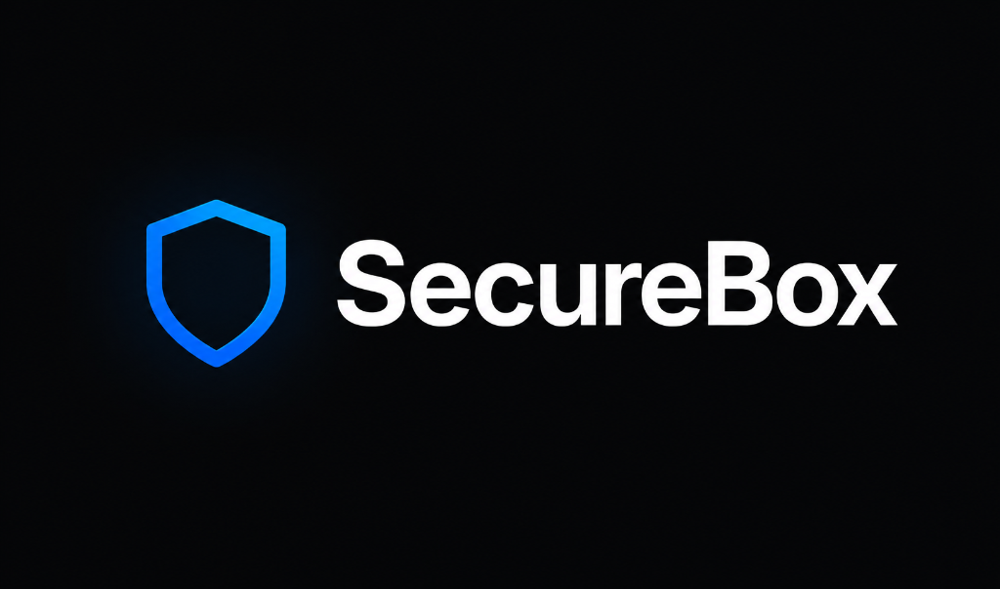
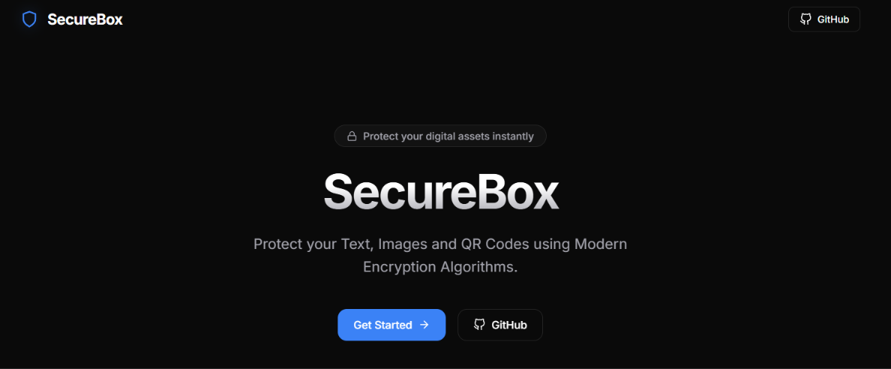
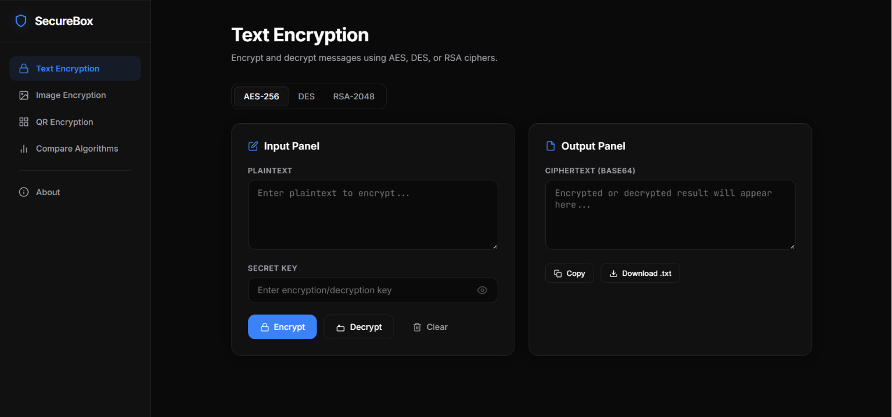
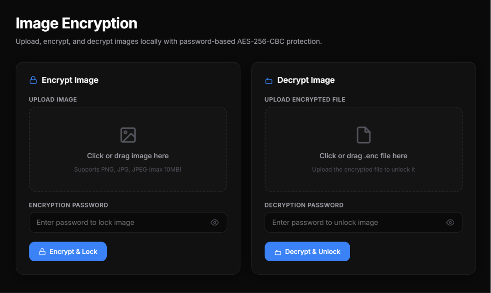
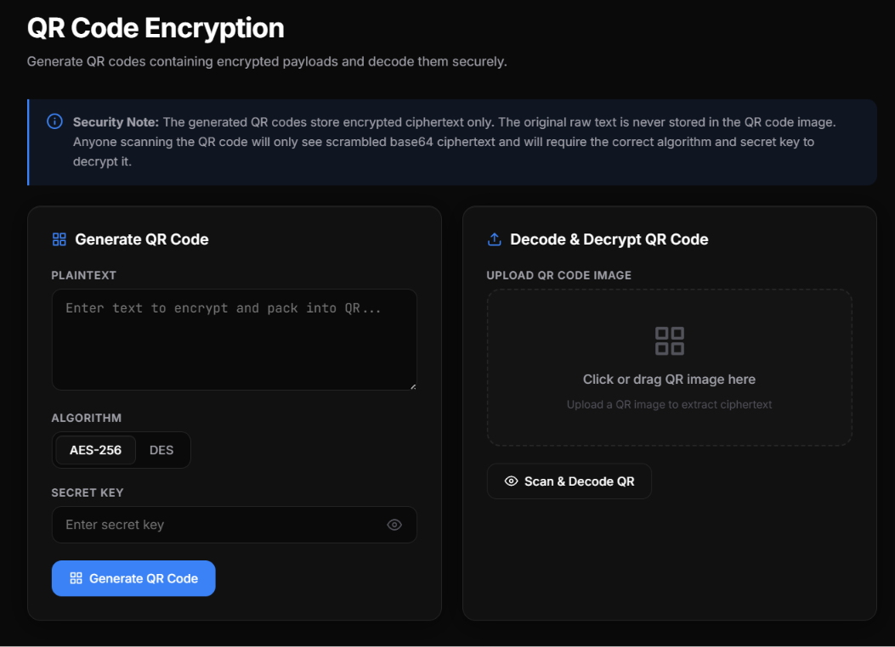
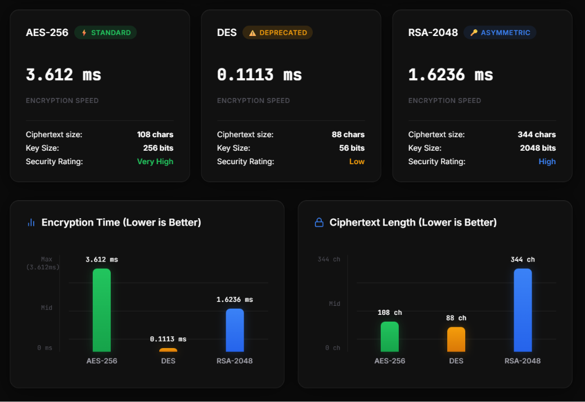

<p align="center">
  
</p>

<p align="center">
  <strong>A modern web application for encrypting text, images, and QR codes using industry-standard cryptographic algorithms.</strong>
</p>

<p align="center">
  <a href="https://securebox-ten.vercel.app">
    
  </a>
</p>

<p align="center">
  
  
  
  
  
  
  
</p>

---

## 📖 Overview

**SecureBox** is a clean and modern web application built with **Flask, HTML, CSS, and JavaScript** that demonstrates the fundamentals of cryptography through an interactive interface.

It allows users to encrypt and decrypt text, securely encrypt image files, generate encrypted QR codes, and compare the characteristics of different encryption algorithms — all through a premium dark-themed UI inspired by Linear, Vercel, and Raycast.

> Built for educational purposes to understand how modern encryption techniques work in real-world applications.

---

## 📸 Screenshots

### 🏠 Landing Page

<p align="center">
  
</p>

---

### 🔐 Text Encryption

<p align="center">
  
</p>

---

### 🖼️ Image Encryption

<p align="center">
  
</p>

---

### 📱 QR Code Encryption

<p align="center">
  
</p>

---

### 📊 Compare Algorithms

<p align="center">
  
</p>

---

## ✨ Features

### 🔐 Text Encryption
- **AES-256** encryption (industry standard)
- **DES** encryption (legacy, educational)
- **RSA-2048** asymmetric encryption
- Encrypt & Decrypt with a single click
- Copy encrypted text to clipboard
- Download encrypted output as `.txt`
- RSA key pair generation & download

### 🖼️ Image Encryption
- Upload PNG, JPG, or JPEG images
- AES-256-CBC byte-level image encryption
- Download encrypted `.enc` file
- Upload `.enc` file to decrypt back to original
- Live image preview after decryption
- Drag & drop file upload

### 📱 QR Code Encryption
- Encrypt text using AES or DES
- Generate QR code from ciphertext
- Download QR code as PNG
- Upload and scan QR codes
- Decrypt scanned ciphertext data

### 📊 Algorithm Comparison
- Side-by-side benchmark of AES, DES, and RSA
- Visual bar charts for encryption speed
- Ciphertext expansion comparison
- Key size strength visualizer
- Detailed comparison table
- Educational crypto analysis

---

## 🛠 Tech Stack

| Layer | Technologies |
|-------|-------------|
| **Frontend** | HTML5, CSS3, Vanilla JavaScript |
| **Backend** | Python, Flask |
| **Crypto** | PyCryptodome (AES, DES, RSA) |
| **Imaging** | Pillow |
| **QR Codes** | qrcode, pyzbar |
| **Deployment** | Vercel (Serverless Python) |

---

## 📂 Project Structure

```
SecureBox/
│
├── app.py                  # Flask application & routes
├── requirements.txt        # Python dependencies
├── vercel.json             # Vercel deployment config
│
├── crypto/                 # Encryption engines
│   ├── aes.py              # AES-256-CBC
│   ├── des.py              # DES-CBC
│   ├── rsa.py              # RSA-2048 OAEP
│   ├── image_crypto.py     # Image byte-level encryption
│   └── qr_generator.py     # QR generation & decoding
│
├── templates/              # Jinja2 HTML templates
│   ├── base.html           # Layout skeleton
│   ├── landing.html        # Home / dashboard
│   ├── text.html           # Text encryption page
│   ├── image.html          # Image encryption page
│   ├── qr.html             # QR code page
│   ├── compare.html        # Algorithm benchmark page
│   └── about.html          # Cryptographic references
│
├── static/
│   ├── css/style.css       # Custom dark theme
│   └── js/main.js          # UI interactions & clipboard
│
└── screenshots/            # README screenshots
```

---

## 🚀 Installation

**Clone the repository**

```bash
git clone https://github.com/Yashkush06/SecureBox.git
cd SecureBox
```

**Create a virtual environment**

```bash
python -m venv venv
```

**Activate the environment**

```bash
# Windows
venv\Scripts\activate

# Linux / macOS
source venv/bin/activate
```

**Install dependencies**

```bash
pip install -r requirements.txt
```

**Run the application**

```bash
python app.py
```

**Open in browser**

```
http://127.0.0.1:5000
```

---

## 🌐 Deploy on Vercel

This project is optimized for Vercel's serverless Python runtime.

```bash
npm i -g vercel
vercel login
vercel --yes
```

Or simply import the GitHub repo at [vercel.com/new](https://vercel.com/new).

---

## 🔒 Algorithms Used

| Algorithm | Type | Key Size | Use Case |
|-----------|------|----------|----------|
| **AES-256** | Symmetric | 256 bits | Industry standard for bulk encryption |
| **DES** | Symmetric | 56 bits | Legacy — included for educational purposes |
| **RSA-2048** | Asymmetric | 2048 bits | Secure key exchange & digital signatures |

---

## 📚 What I Learned

- Symmetric vs Asymmetric encryption
- AES, DES, and RSA implementation using PyCryptodome
- Image encryption using byte-level AES-CBC
- QR code generation and decoding
- Flask server-rendered web applications
- Secure handling of cryptographic keys
- Clean, modern UI/UX design principles
- Serverless deployment on Vercel

---

## ⚠️ Disclaimer

This project is intended for **educational and demonstration purposes only**.

- DES is included only to demonstrate older encryption techniques and should **not** be used in production.
- RSA keys are generated on demand and are **never stored** on the server.
- Keys and data exist in memory only for the duration of the HTTP request.

---

## 🚧 Future Improvements

- [ ] User Authentication
- [ ] File Encryption (PDF, ZIP, etc.)
- [ ] Digital Signatures
- [ ] AES-GCM Authenticated Encryption
- [ ] Secure Key Storage
- [ ] API Endpoints
- [ ] Dark / Light Theme Toggle

---

## 🤝 Contributing

Contributions, suggestions, and improvements are welcome!

Feel free to fork the repository and submit a pull request.

---

## 📄 License

This project is licensed under the **MIT License**.

---

## 👨‍💻 Author

**Yash Kushwah**

[](https://github.com/Yashkush06)
[](https://linkedin.com/in/yash-kushwah)

---

<p align="center">
  ⭐ If you found this project helpful, consider giving it a star!
</p>
