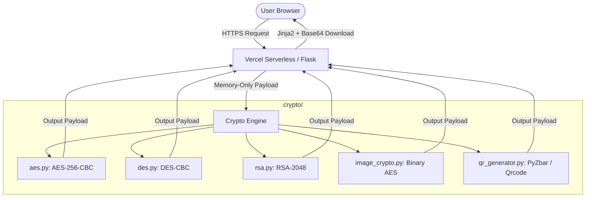

# 🔐 SecureBox — Modern Encryption & Cryptography Toolkit

<p align="center">
  
</p>

<h3 align="center">SecureBox</h3>
<p align="center">A premium, serverless-ready cybersecurity web application for text, image, and QR code encryption.</p>

<p align="center">
  <a href="https://securebox-ten.vercel.app"></a>
  <a href="https://github.com/Yashkush06/SecureBox"></a>
  
</p>

---

## 🌐 Live Application
The project is deployed and fully operational at:  
👉 **[https://securebox-ten.vercel.app](https://securebox-ten.vercel.app)**

---

## 🎨 System Architecture

SecureBox is engineered as a **100% memory-only, stateless serverless application** using Python Flask and vanilla CSS/JS. It does not write temporary files or sessions to disk, ensuring maximum security and making it fully compatible with ephemeral platforms like Vercel.



---

## 🚀 Key Features

### 1. 📝 Text Encryption
* Supports **AES-256-CBC** (Symmetric), **DES-CBC** (Legacy/Symmetric), and **RSA-2048** (Asymmetric).
* Ehemeral, in-memory **RSA keypair generation** (instantly downloadable as `.pem` files).
* **Smart Input Resolution**: Paste your inputs in either panel, and the app resolves encryption and decryption automatically.
* Fast Copy-to-Clipboard and text file downloads.

### 2. 🖼️ Image Cryptosystem
* Secure password-based **AES-256-CBC byte-level encryption** for PNG, JPG, and JPEG files (up to 10MB).
* Dynamic drag-and-drop file upload zones.
* **100% memory-safe**: Encrypted files are downloaded instantly as `.enc` binary blobs without ever hitting the server's disk.
* Decrypted files render an inline browser-safe Base64 preview for immediate download.

### 3. 📱 QR Code Payload Packer
* Encrypts plaintext using AES/DES and encodes the resulting ciphertext directly into a downloadable **PNG QR Code**.
* Uploads and decodes QR images using `PyZbar` to extract ciphertext, then prompts for the key to decrypt back to plaintext.

### 4. 📊 Multi-Metric Benchmarking
* Compare AES-256, DES, and RSA-2048 side-by-side using the same plaintext.
* Measures encryption times (in ms) and displays output lengths.
* Interactive, relative **CSS-only Bar Charts** comparing execution speeds and payload expansions.
* Visual key length visualizer comparing keys (56-bit DES vs. 256-bit AES vs. 2048-bit RSA) to highlight asymmetric scale.

---

## 🛠️ Installation & Local Running

### Prerequisites
* Python 3.10+
* Node.js & npm (for Vercel CLI, optional)

### Step-by-Step Run
1. **Clone the repository**:
   ```bash
   git clone https://github.com/Yashkush06/SecureBox.git
   cd SecureBox
   ```

2. **Create and activate a virtual environment**:
   ```bash
   # Windows
   python -m venv .venv
   .venv\Scripts\activate

   # macOS/Linux
   python3 -m venv .venv
   source .venv/bin/activate
   ```

3. **Install dependencies**:
   ```bash
   pip install -r requirements.txt
   ```

4. **Start the local server**:
   ```bash
   python app.py
   ```
   Open **[http://127.0.0.1:5000](http://127.0.0.1:5000)** in your browser.

---

## 📂 Project Structure

```
SecureBox/
├── crypto/                 # Cryptography engines
│   ├── __init__.py
│   ├── aes.py              # AES-256-CBC implementation
│   ├── des.py              # DES-CBC implementation
│   ├── rsa.py              # RSA-2048 key-gen & OAEP cipher
│   ├── image_crypto.py     # Binary image AES cryptosystem
│   └── qr_generator.py     # QR generation & decoding (PyZbar)
├── static/                 # Static assets
│   ├── css/
│   │   └── style.css       # Custom dark-theme stylesheet
│   └── js/
│       └── main.js         # UI interactions, clipboard, & toasts
├── templates/              # Jinja2 layouts and pages
│   ├── base.html
│   ├── base_error.html     # Custom error page
│   ├── landing.html        # App dashboard
│   ├── text.html           # Text enc/dec page
│   ├── image.html          # Image enc/dec page
│   ├── qr.html             # QR payload page
│   ├── compare.html        # Benchmark page
│   └── about.html          # Educational references
├── app.py                  # Flask entry point and routing layer
├── requirements.txt        # Backend dependencies
├── vercel.json             # Vercel deployment configuration
└── README.md
```

---

## ⚡ Deployment on Vercel

This repository is optimized for Vercel Serverless. To deploy your own instance using the Vercel CLI:

1. **Log in to Vercel**:
   ```bash
   vercel login
   ```
2. **Deploy project**:
   ```bash
   vercel --name securebox --yes
   ```

---

## 🛡️ Educational Disclaimer
> [!WARNING]
> SecureBox is designed strictly as an educational and demonstration toolkit. Keys and payloads reside in memory for the lifecycle of the HTTP request and are never saved on the server. Do not use this application to protect sensitive production data.
